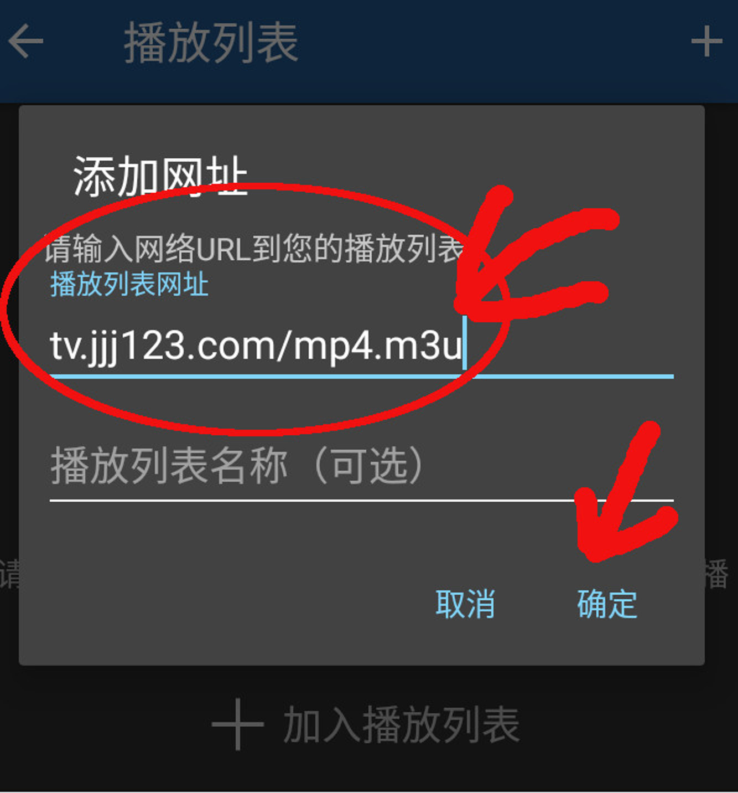

+++
title = " 002 tv电视 手机软件的设置"
description = ""
weight = 20
+++

* 手机电视软件 设置安装完成之后，需要进行设置：点击添加，然后加入以下地址：

    tv.jjj123.com/mp4.m3u

    填入并确定后，就可以开始使用了。

* 如果，你网络太慢，那么，你只能听声音了。把网址换成：

    tv.jjj123.com/mp3.m3u

    就可以了。

